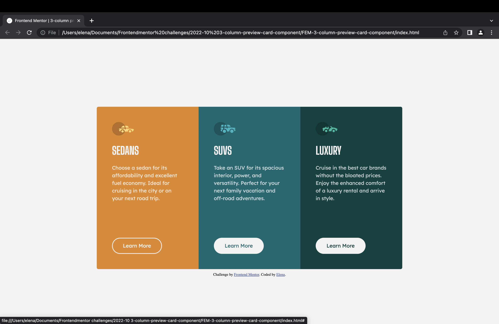

# Frontend Mentor - 3-column preview card component solution

This is a solution to the [3-column preview card component challenge on Frontend Mentor](https://www.frontendmentor.io/challenges/3column-preview-card-component-pH92eAR2-). Frontend Mentor challenges help you improve your coding skills by building realistic projects. 

## Table of contents

- [Overview](#overview)
  - [The challenge](#the-challenge)
  - [Screenshot](#screenshot)
  - [Links](#links)
- [My process](#my-process)
  - [Built with](#built-with)
  - [What I learned](#what-i-learned)
  - [Continued development](#continued-development)
- [Author](#author)

## Overview

### The challenge

Users should be able to:

- View the optimal layout depending on their device's screen size
- See hover states for interactive elements

### Screenshot

### Links

- Solution URL: [https://github.com/ElenaUJ/FEM-3-column-preview-card]
- Live Site URL: [https://elenauj.github.io/FEM-3-column-preview-card/]

## My process

### Built with

- Semantic HTML5 markup
- BEM methodology
- ITCSS
- CSS custom properties
- CSS Grid

### What I learned

First and foremost, this is my first frontendmentor challenge and my second HTML/CSS  project in my life. I started a web development course a few weeks ago and built a simple website with their instructions. So, now, for the first time I had to come up with my own solutions. I got to apply what I had learned in the weeks before. I practiced and learnt a lot! Coming up with my own HTML and CSS structure and solutions, thinking of names for HTML classes, understanding and practicing CSS variables and grid a bit more, googling and figuring out a few new CSS properties. It's been very rewarding!

This CSS property was new to me:

overflow: hidden;

And these are properties I understad better now

.button {
  display: inline-block;
}

.button:hover {
  background-color: inherit;
}

### Continued development

I want to complete more challenges, to practice what I have learned and finding new solutions. In particular, I would like to learn to use CSS grid in a more complex way. Also, I want to find out if there are better ways to standardize box layout properties like padding, margin, centering of elements.

## Author

- Frontend Mentor - [@ElenaUJ](https://www.frontendmentor.io/profile/ElenaUJ)